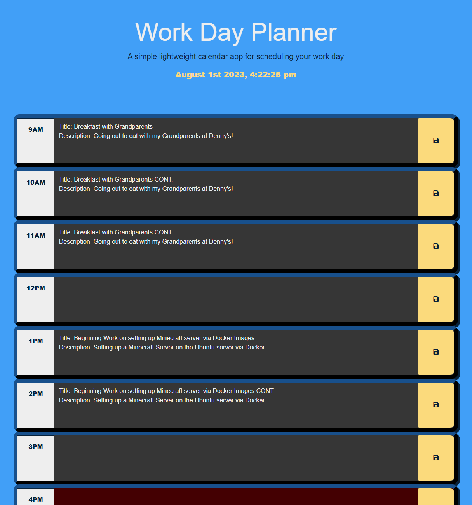
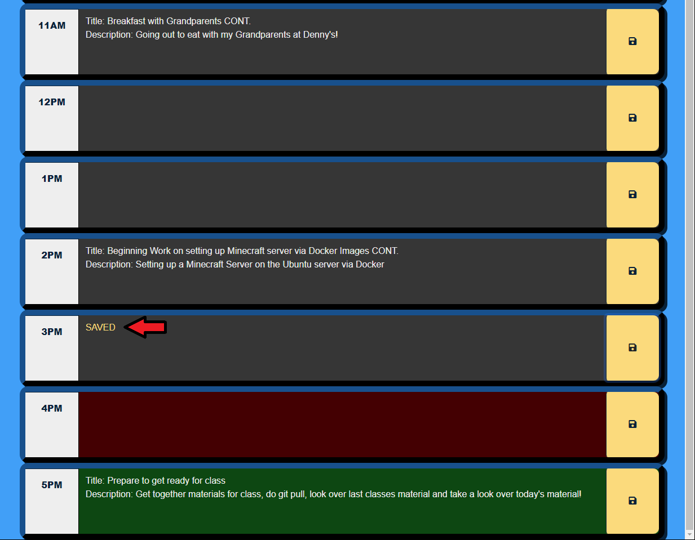
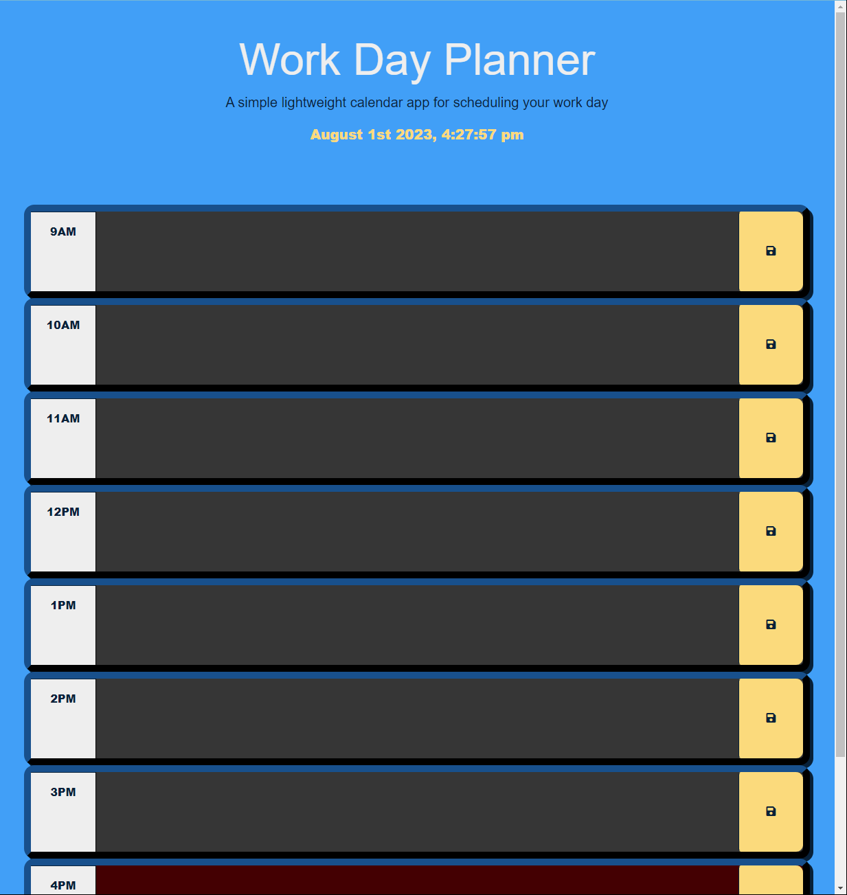

# CWRU Bootcamp Challenge 5 - Work Day Planner

## Description

1. In this challenge, my main goal was to create a Work Day Planner that would span an entire workday (9am to 5pm) and as the day progresses, would change the color of the different sections to correspond with the given time. In addition, within each section the user would be able to input and save events within the webpage so that they will persist upon refresh.

2. In this project, I practiced using third party libraries, DOM traversal with third-party libraries,implementing datetime functionality within an application and allowing dynamic updates via setInterval() and setTimeout()!

3. I found that reusuing the same colors from a previous project to update the color scheme proved very useful! Chances to recycle concepts from previous projects seems integral in some instances to further build upon chances to learn.

4. Adding and removing classes to allow color change to occur seemed like a very fun concept, rather than directly changing the CSS directly for each section one by one.

## Installation and Usage

Simply use the download all of the files provided and open the index.html in your file viewer of choice!
To look at the source code, open it, the CSS file and the Javascript file in a text file editor of choice!

If your plan is to just take a look at functionality, feel free to use the link to the deployed page given below!

## Mockup:
The following images shows the web application's appearance and functionality:

## Credits
 
 Editing of code done by myself, <b>Anthony Iacano</b>
  
  
 Javascript Libraries used within the project: <b><i>JQuery, MomentJS</i></b>
  
  
 CSS Framework used within the project: <b><i>Bootstrap</i></b> 
  
  
 Lesson provided by <b>edX Boot Camps LLC.</b>

## Link to Deployed Page

 https://anthony-gg.github.io/work-day-planner/

 ## License

Please reference the **LICENSE.MD** file inside of the repository.

---